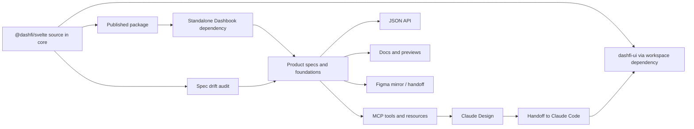
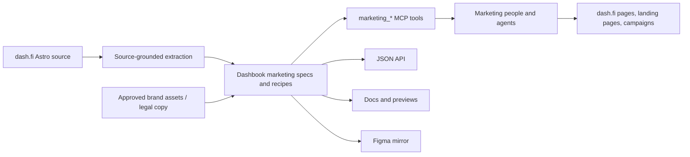

# Dashbook authority, handoff, and operating model

> **Status:** Living operating contract  
> **Audience:** Engineers, designers, marketing teams, maintainers, and coding agents  
> **Last verified:** 2026-07-16  
> **Current phase:** Standalone Dashbook repository; core Nx migration planned  
> **Public surface:** `https://brand.dash.fi` is already live — it is the custom domain of the standalone Vercel deployment (`dashbook.vercel.app` also resolves). The Nx migration re-hosts what sits behind `brand.dash.fi` (Vercel → core/AWS); it does not introduce the domain.  
> **Authority state:** Dashbook is a downstream mirror and delivery layer **today**. The **decided direction** (2026-07-16) is for Dashbook to become the source of truth — a single tokenized source driving the product and marketing code apps and the Figma library. Authority flips only when the §14 gates pass; until then the current implementation wins and Dashbook is corrected to match it.

This document is the durable context and execution model for Dashbook. It
exists because the project spans multiple repositories, design systems,
frameworks, audiences, and agent surfaces, and because older documentation uses
the phrase “source of truth” for several different things.

When another document, skill, generated artifact, PR description, or agent
prompt disagrees with this model, follow the precedence rules below. Update this
document whenever authority, repository topology, handoff behavior, or migration
state changes.

---

## 1. Executive summary

Dashbook serves two related but independently governed design systems:

1. **Product design system** — used primarily by developers building
   dashfi-ui and other application surfaces.
2. **Marketing design system** — used primarily by marketing and web teams to
   build dash.fi pages, standalone landing pages, and campaigns.

They have different current authorities:

- The product component implementation authority is `@dashfi/svelte` in the
  core monorepo.
- The product application is evidence for real composition and usage patterns,
  but it does not override the shared component implementation.
- The marketing implementation authority is the live dash.fi website source.
- Dashbook reverse-documents and distributes both systems through MCP, skills,
  JSON APIs, and human-readable pages.
- Figma is currently a downstream mirror and design/handoff surface.

The synchronization direction today is therefore asymmetric:

```text
@dashfi/svelte ───────────────→ Dashbook product specs and foundations
dashfi-ui usage ──────────────→ Dashbook product composition patterns
dash.fi website source ───────→ Dashbook marketing specs and recipes
approved assets and copy ─────→ Dashbook brand/marketing delivery tools
Dashbook structured data ─────→ MCP, skills, JSON API, docs, Figma
```

The reverse arrows are not automatic. A mismatch in Dashbook is not permission
to change a production component or the marketing website. Until authority is
formally transferred, the current implementation wins and Dashbook must be
corrected. If the implementation itself appears wrong, raise a separately
reviewed design-system change against the authoritative repository.

Moving Dashbook into the core Nx monorepo will remove repository and package
distance, but **co-location alone does not transfer authority**. Dashbook should
only become an upstream source after its consumers actually derive from it and
the ownership, generation, validation, and release controls described here are
in place.

---

## 2. Precedence and conflict-resolution rules

Use this order whenever sources disagree.

### 2.1 Product components

1. The component source that ships from
   `core/libs/svelte-components/lib/src/lib/`.
2. The built/published `@dashfi/svelte` version consumed by the target project.
3. Component tests, stories, and production usage in core.
4. Dashbook structured specs, foundations, previews, and prose.
5. Figma components, screenshots, and generated Design output.

The target project’s installed version matters. Dashbook may accurately
describe core HEAD while a consumer is pinned to an older package. Handoff
metadata should eventually carry both the source revision last audited and the
package/version expectation.

### 2.2 Product composition patterns

1. Repeated, current usage in dashfi-ui or another designated production app.
2. Shared component APIs from `@dashfi/svelte`.
3. Dashbook’s documented composition recipe.
4. Figma or Claude Design composition.

Product patterns may simplify business logic, but must not invent shared
component props or recreate shared primitives.

### 2.3 Marketing

1. Current source in the canonical dash.fi website repository.
2. Approved brand assets, legal copy, and campaign-specific requirements.
3. Dashbook marketing foundations, patterns, recipes, and previews.
4. Figma compositions and generated campaign output.

Dashbook marketing patterns are generally recipes, not a promise of an
importable cross-repository component package.

### 2.4 Brand assets and regulated copy

The approved asset or approved legal-copy source wins. Dashbook is a controlled
distribution surface, not permission to redraw a wordmark or rewrite regulated
language. If the approved source cannot be located, stop and surface the gap.

### 2.5 This document versus volatile state

- This document owns the authority model, handoff policy, governance, and
  migration gates.
- Code owns actual runtime behavior.
- `PLAN.md` owns broader roadmap history, but its counts and status rows can
  drift.
- GitHub owns current PR state.
- MCP list operations own current registry counts.
- Skills explain how agents should use the system, but must be regenerated or
  corrected when they contradict this document or code.

Never copy a hard-coded count, version, token value, URL, or branch state from
this document without checking the appropriate live source when the value
matters to the task.

---

## 3. Project purpose and boundaries

### 3.1 What Dashbook is

Dashbook is all of the following:

- a structured catalogue of product components and foundations;
- a structured catalogue of product composition patterns;
- a reverse-documented catalogue of marketing foundations and patterns;
- a brand asset, partner-kit, voice, and legal-copy delivery surface;
- an MCP server and JSON API for agentic consumers;
- a bundled skill/plugin that teaches receiving agents how to use the data;
- a human-readable brand and design-system portal;
- a Figma handoff input and eventual Code Connect bridge;
- a drift-detection and governance point between implementation and
  documentation.

### 3.2 What Dashbook is not today

Dashbook is not currently:

- the authority that may restyle `@dashfi/svelte` to match its own mirror;
- the authority that may restyle dash.fi marketing pages to match a recipe;
- a cross-framework runtime component library;
- proof that a Design-generated approximation should be committed as a local
  component in a Svelte application;
- a replacement for reviewing production component source;
- a reason to change legal copy without compliance review;
- authoritative merely because it is easier for an agent to query.

### 3.3 Primary usage surface

People use Dashbook primarily through MCP and skills. The website remains
important for human discovery, visual review, and assets, but agent-facing
structured interfaces are product-critical. A change that looks correct on a
web page but produces incomplete MCP, resource, JSON, or skill output is not
complete.

---

## 4. Repository and runtime map

Paths below describe the verified local topology as of 2026-07-16. Agents must
confirm branches and worktrees before editing.

| Concern                     | Repository / path                                                   | Current role                                                                                       |
| --------------------------- | ------------------------------------------------------------------- | -------------------------------------------------------------------------------------------------- |
| Dashbook                    | `/Users/zy/dev/dashbook`                                            | Standalone SvelteKit portal, MCP server, JSON API, skills/plugin, specs, and previews              |
| Core monorepo               | `/Users/zy/dev/dash/core`                                           | Nx workspace containing the component library, dashfi-ui, and an older brand-book scaffold         |
| Shared Svelte library       | `core/libs/svelte-components/lib`                                   | Product component implementation authority; published as `@dashfi/svelte`                          |
| Product application         | `core/packages/dashfi-ui/app`                                       | Main Svelte product consumer and product-pattern evidence                                          |
| Existing Nx brand scaffold  | `core/packages/brand-book/app` and `core/packages/brand-book/infra` | Old one-page/static scaffold and Terraform; migration substrate, not the current Dashbook codebase |
| Marketing website           | `/Users/zy/dev/dash/www.dash.fi`                                    | Astro/React dash.fi implementation and marketing authority                                         |
| Figma library               | External Figma file                                                 | Downstream mirror and design/handoff surface                                                       |
| Public domain               | `brand.dash.fi` (live now)                                          | Already the custom domain of the standalone Vercel deploy; `dashbook.vercel.app` also resolves      |
| Hosting                     | Vercel today → core/AWS after migration                             | Migration re-hosts `brand.dash.fi` behind core infra; the public domain itself does not change      |

Older documentation alternates between `core/packages/brand/` and the existing
`core/packages/brand-book/` path. The migration must explicitly choose the Nx
project name and destination. Do not infer that copying files into the old
scaffold completes the migration; the scaffold is materially behind current
Dashbook and does not contain the MCP/API/runtime surface.

### 4.1 Product data flow today



### 4.2 Marketing data flow today



---

## 5. Authority matrix

The word “owner” below means authority over the represented fact, not
necessarily organizational staffing ownership.

| Domain                                                   | Current authority                                       | Dashbook responsibility                                                        | What Dashbook may change independently                            | What requires upstream review                                |
| -------------------------------------------------------- | ------------------------------------------------------- | ------------------------------------------------------------------------------ | ----------------------------------------------------------------- | ------------------------------------------------------------ |
| Product component implementation                         | `@dashfi/svelte` source                                 | Mirror anatomy, variants, props, tokens, import path, and usage guidance       | Explanatory prose, search metadata, presentation, handoff routing | Component markup, API, styles, defaults, tokens, behavior    |
| Product semantic tokens as rendered by shared components | Shared library theme/token source                       | Resolve and expose exact light/dark values; detect drift                       | Documentation and generated downstream mirrors                    | Any production token value or role change                    |
| Product application patterns                             | Repeated production usage in dashfi-ui plus shared APIs | Extract reusable composition, rationale, and non-features                      | Documentation structure and simplified demo data                  | Changes to actual application flows or shared component APIs |
| Marketing visual implementation                          | dash.fi website source                                  | Reverse-document tokens, sections, DOM recipes, props, gotchas, and provenance | Recipe prose, indexing, examples that remain faithful             | Marketing component/token changes on dash.fi                 |
| Marketing campaign output                                | Campaign brief plus dash.fi language                    | Supply approved recipes, assets, and voice                                     | Templates and guidance                                            | New visual language or exceptions to brand policy            |
| Logos and brand assets                                   | Approved asset source                                   | Deliver exact variants and formats                                             | Packaging, metadata, download UX                                  | Redrawing, substituting, or modifying the underlying mark    |
| Legal/compliance copy                                    | Approved legal source                                   | Deliver verbatim versioned text                                                | Indexing and selection guidance                                   | Any wording change                                           |
| Handoff routing                                          | Dashbook structured contract                            | Tell receivers whether to import, port, or follow a recipe                     | Routing metadata, validation, and agent instructions              | A policy change that alters which implementation is required |
| Figma                                                    | Upstream systems above                                  | Mirror variables, components, and mappings                                     | Sync tooling and downstream organization                          | Using Figma drift to silently redefine production values     |
| Dashbook chrome                                          | Dashbook repository                                     | Own its portal UX                                                              | Portal-only layout, navigation, search, and presentation          | Anything presented as a product or marketing canonical value |

---

## 6. Product design-system operating model

### 6.1 Shared components are implementation, not reference art

For Svelte and SvelteKit product work, a listed shared component is a required
implementation dependency unless an explicit exception is approved. Its
Dashbook anatomy is supporting evidence. It is not a template to recreate.

Correct behavior:

```svelte
<script lang="ts">
	import { Button } from '@dashfi/svelte/ui/button';
</script>

<Button>Continue</Button>
```

Incorrect behavior in a Svelte consumer:

```svelte
<button class="locally-recreated-dash-button">Continue</button>
```

The incorrect version remains incorrect even if it visually matches a Claude
Design frame at the moment it is written. It forks accessibility, behavior,
future fixes, tokens, variants, and API conventions away from the shared
library.

### 6.2 Foundation has a legitimate but bounded role

Claude Design cannot render Svelte components directly, so it needs component
anatomy and Foundation information to construct a visual approximation. That
path is legitimate for design exploration and for non-Svelte implementations.

Foundation must therefore be accurate, but accuracy does not turn the
approximation into the implementation for Svelte. During handoff, the receiver
must preserve the design intent while replacing recognizable approximations
with exact shared imports.

### 6.3 Product patterns

Product patterns describe composition above individual components: protected
shells, data tables, bulk actions, settings sections, dialogs, onboarding, and
similar recurring structures.

Patterns should:

- cite the production route/module used as evidence;
- use public `@dashfi/svelte` components in demos;
- omit app-private business logic and data access;
- clearly label simplifications;
- distinguish shared component requirements from page-specific composition;
- record when the source was last checked.

Patterns must not become a hidden local component library inside Dashbook.

---

## 7. Marketing design-system operating model

### 7.1 The website leads; Dashbook follows

Marketing components and patterns existed on dash.fi before Dashbook. Dashbook
documents the language that the website actually uses. It should not clean up,
normalize, or redesign that language without a separately approved marketing
change.

The core flow is:

```text
ship or change on dash.fi
    → inspect the real source
    → update Dashbook recipe/spec/foundation
    → update MCP/JSON/docs/Figma mirrors
```

### 7.2 Recipes versus imports

Most Dashbook marketing patterns are portable recipes: DOM shape, semantic
tokens, typography, motion, variants, accessibility, and gotchas. They are not
necessarily importable from a shared package.

When the target is the canonical dash.fi repo, reuse its existing primitives,
sections, rhythm components, and widgets. When the target is a standalone
campaign or another framework, use the Dashbook recipe while preserving the
approved token and asset contract.

### 7.3 Required provenance

Every marketing spec should eventually carry:

- canonical repository;
- canonical file or route;
- source commit/revision;
- `lastVerifiedAt` date;
- verification status: `verified`, `partially-verified`, `unverified`, or
  `stale`;
- known differences between the reusable recipe and the production page;
- whether the pattern is current, reserved, deprecated, or no longer observed
  live.

Without provenance, an apparently precise recipe can be an undocumented
interpretation of an older page.

### 7.4 Marketing-specific guardrails

- Use semantic marketing roles rather than invented hex values.
- Treat logos, partner marks, and card art as controlled assets.
- Return legal copy verbatim and version it.
- Do not convert a campaign exception into a new general pattern without
  explicit review.
- Keep dark-mode/tone behavior separate from product application theming where
  the website does so.

---

## 8. Design-to-code handoff contract

The handoff problem has two independent failure modes:

1. Dashbook anatomy/Foundation drifts from the real implementation.
2. The receiving coding agent treats the Design approximation as code truth and
   recreates a component that already exists.

Both must be solved. Fixing only the anatomy still leaves duplicate local
components. Fixing only the receiving prompt still imports a correct component
into a design whose dimensions may have been based on stale data.

### 8.1 Required decision sequence

Every receiver should perform these steps before implementing a handed-off
screen:

1. Identify whether the work is product, marketing, or mixed.
2. Identify the target framework and repository.
3. Inventory recognizable Dashbook components in the handoff.
4. Query current component metadata; do not guess slugs or imports.
5. Apply the runtime decision table below.
6. Replace Design-generated shared-component approximations with the required
   implementation.
7. Preserve page composition, content hierarchy, and business behavior around
   those components.
8. Validate the result against both the handoff and the authoritative runtime.

### 8.2 Runtime decision table

| Target                                                                      | Required path                                                                                  |
| --------------------------------------------------------------------------- | ---------------------------------------------------------------------------------------------- |
| dashfi-ui or another core SvelteKit app                                     | Import the exact `@dashfi/svelte` implementation via workspace dependency                      |
| External Svelte/SvelteKit project already using `@dashfi/svelte`            | Import the exact package implementation                                                        |
| Svelte project that is allowed to add `@dashfi/svelte`                      | Add the compatible package, then import; do not recreate merely to avoid the dependency        |
| Svelte project where the package cannot be used                             | Treat as an explicit exception and use the porting contract; record why reuse was impossible   |
| Astro project with Svelte integration and an established package dependency | Reuse the Svelte component where architecture permits                                          |
| Astro without Svelte, React, React Native, Vue, or plain HTML/CSS           | Use `product_port_to` / the non-Svelte Foundation path                                         |
| Canonical dash.fi marketing repo                                            | Reuse existing website primitives and sections; use Dashbook as a source-grounded recipe/index |
| Standalone marketing/campaign surface                                       | Follow marketing recipe, tokens, approved assets, and target-framework conventions             |

### 8.3 Machine-readable implementation metadata

Every component response should expose enough information for deterministic
routing. The implemented #17 shape establishes the minimum:

```ts
type ComponentImplementation =
	| {
			kind: 'shared-svelte-component';
			reusePolicy: 'required-in-svelte';
			package: '@dashfi/svelte';
			importPath: string;
			importStatement: string;
			canonicalSource: string;
			handoffDirective: string;
			nonSvelteFallback: {
				action: 'port';
				tool: 'product_port_to';
				instruction: string;
			};
	  }
	| {
			kind: 'dashbook-scaffold';
			reusePolicy: 'reference-guidance';
			importPath: string;
			canonicalSource: string;
			handoffDirective: string;
	  };
```

The next iteration should add provenance without breaking existing clients:

```ts
type Provenance = {
	sourceRepository: string;
	sourceRevision: string;
	sourceVersion?: string;
	lastVerifiedAt: string;
	verificationStatus: 'verified' | 'partial' | 'unverified' | 'stale';
};
```

The same enriched object must be returned by:

- `product_get_component`;
- `product_list_components` where practical;
- `dashbook://components`;
- `dashbook://components/{slug}`;
- `/api/components.json`;
- `/api/components/{slug}.json`;
- any page-template or handoff-specific endpoint;
- the receiving skill/plugin guidance.

If tools, resources, JSON, and skills disagree, agents will take different
paths depending on client capabilities. That is a product defect.

### 8.4 Receiving-repository guardrail

Dashbook-side metadata may be stripped or summarized during Design handoff.
Repositories that commonly receive Dashbook designs should also carry a short
local rule:

> When a handed-off product UI resembles a Dashbook component and the project
> can consume `@dashfi/svelte`, query Dashbook and use the exact shared import.
> Do not recreate it from generated HTML, CSS, anatomy, or screenshots.

This belongs in core agent guidance and in other frequently targeted
repositories. The receiver should also scan the completed diff for local
buttons, inputs, cards, badges, dialogs, tables, tabs, pagination, and other
duplicates before marking the work complete.

---

## 9. Fidelity and drift control

### 9.1 The audit is asymmetric today

The audit compares Dashbook against the current upstream implementation. Its
safe write mode may correct Dashbook. It must not rewrite core or dash.fi.

```text
authoritative source → evidence extraction → comparison → Dashbook correction
```

### 9.2 Product audit

PR #17 introduces a reusable audit runner with these interfaces:

```bash
pnpm spec-audit
pnpm spec-audit --write
pnpm spec-audit --json
pnpm spec-audit --strict
```

Standalone mode reads the pinned package. Migration mode can read live core
source through `DASHBOOK_LIB_ROOT`.

The safe enforced scope is intentionally narrow:

- resolved light/dark token values are compared and may be mechanically
  rewritten in Dashbook;
- source token coverage gaps are reported;
- dimension classes that cannot be directly traced are reported;
- prose, part selection, variant ordering, rationale, and non-features remain
  human-owned;
- runtime, inherited, CSS-driven, or structurally complex components require
  review rather than confident auto-generation.

> **Perishable snapshot — regenerate with `pnpm spec-audit`; do not copy these numbers.**

Snapshot (last refreshed 2026-07-16):

- 26 engine tests passed;
- 0 stale resolved values against the pinned package;
- 62 registered shared-component specs — the inventory is now complete: Sidebar
  (from the Sidebar spec PR) and PaginationWrapper (added by #17) both exist;
- advisory source-token coverage gaps and untraced dimension classes remain, and
  their counts change per run.

These are not permanent catalogue facts. Always run the audit and the list tool
instead of copying a number into a skill or another document.

### 9.3 What audit success means

`0 stale resolved values` means recorded resolved token values match the
audited theme. It does not prove:

- exhaustive structural parity;
- complete token-part documentation;
- correct cross-component inheritance;
- correct runtime behavior;
- correct accessibility;
- correct prose or usage guidance;
- visual identity across every viewport and state.

Do not turn a narrow green result into a broad parity claim.

### 9.4 Marketing audit

Marketing needs a parallel, provenance-first audit rather than the exact same
component parser:

1. Resolve each spec’s canonical source in `www.dash.fi`.
2. Record the source commit and verification date.
3. Compare props, DOM structure, tokens, responsive behavior, motion, and
   variants.
4. Mark intentional simplifications explicitly.
5. Flag patterns not observed on the live site.
6. Update Dashbook, not the website, for ordinary mirror drift.
7. Create a separate website change when the upstream implementation is the
   thing being deliberately changed.

### 9.5 Discrepancy workflow

When Dashbook and an authority disagree:

1. Capture exact evidence: source file, revision, package version, rendered
   state, Dashbook field, and affected consumers.
2. Classify the discrepancy:
   - stale Dashbook mirror;
   - consumer version skew;
   - intentional documented exception;
   - likely upstream defect;
   - proposed design-language change.
3. For stale mirror drift, update Dashbook and regenerate downstream artifacts.
4. For version skew, document the supported range and audit the consumer’s
   installed version.
5. For an upstream defect, open a focused change in the authoritative repo and
   keep the Dashbook correction dependent on its approval.
6. For a design-language change, obtain explicit owner approval; do not disguise
   it as reconciliation.
7. Re-run structured, build, and visual verification.

---

## 10. MCP, JSON API, skills, and plugin contract

### 10.1 Namespace model

- `product_*` covers shared components, product foundations, product patterns,
  tokens, search, page templates, and cross-framework porting.
- `marketing_*` covers marketing foundations and patterns, voice, logos,
  approved assets, partner kits, and legal disclosures.
- Mixed product pages may use both: for example, shared form controls from
  `product_*` and a controlled wordmark/legal footer from `marketing_*`.

### 10.2 Structured-data rule

There must be one canonical in-process data path per concept. MCP tools,
resources, JSON endpoints, docs, and search should transform or enrich the same
registered object, not maintain parallel copies.

Required properties:

- output schemas describe fields clients are expected to use;
- `structuredContent` matches the advertised schema;
- resource responses preserve implementation routing;
- JSON endpoints preserve implementation routing;
- list and detail responses agree;
- missing or unsupported capabilities are not advertised;
- counts are derived from registries;
- versions are exposed and release notes explain contract changes.

### 10.3 Skill rules

Skills should teach stable decisions, not freeze volatile facts.

Good skill content:

- how to choose product versus marketing;
- how to route by runtime;
- exact-import policy for Svelte;
- use of porting for other frameworks;
- approved asset/legal-copy constraints;
- how to query live counts and token values.

Fragile skill content:

- hard-coded component counts;
- raw token values presented without provenance/version;
- a deployment URL that is not updated at cutover;
- claims that Dashbook is authoritative before the transition gates pass;
- claims that a generated mirror automatically changes the shared library.

### 10.4 Discovery and origin safety

If ARD advertises an `application/mcp-server-card+json` artifact, its URL must
retrieve a server-card document rather than point directly at the Streamable
HTTP execution endpoint. Origin validation should allow the request’s actual
same origin plus explicitly configured trusted clients. It should not assume
that same-origin browser POSTs omit the `Origin` header, and it should not use a
global wildcard for arbitrary preview domains.

### 10.5 Plugin release discipline

The marketplace listing and plugin manifest must be versioned together.
Handoff-routing changes are user-visible behavior and must ship in the same
plugin version as the schemas/resources they describe, or receive a follow-up
version bump. Release verification should include a fresh client session, not
only repository JSON validation.

---

## 11. Token and generation model

### 11.1 Current authority

- Product values are authoritative where the shared library actually resolves
  its theme and component utilities in core.
- Marketing values are authoritative in the dash.fi website.
- Dashbook token files, generated CSS, TypeScript maps, and Figma payloads are
  mirrors today.

The DTCG/generator work in PR #13 is useful tooling, but the file’s location in
Dashbook does not make it the cross-product authority.

### 11.2 Required near-term behavior

- Reconcile product inputs to actual core-rendered values.
- Reconcile marketing inputs to actual website values.
- Describe the Dashbook DTCG source as a normalized mirror/generation input.
- Add a check mode that fails when generated artifacts differ from committed
  output.
- Keep generated files deterministic.
- Make Figma collection/mode identifiers configuration rather than authority.
- Fail or clearly block on missing Figma variables when a sync claims to
  upsert them.
- Keep MCP/JSON output shapes stable when changing internal token sources.

### 11.3 Future product authority

Per the decided direction (§14), that token authority is **Dashbook's tokenized
source**, living in core after the migration. The Dashbook token source generates
the shared library's theme and the Figma library rather than the reverse. The
safe transition is:

1. Extract current values from the shared library without changing values.
2. Generate the library’s existing theme from the new source.
3. Prove Storybook/component rendering and dashfi-ui are unchanged.
4. Make Dashbook and Figma consume the same core output.
5. Add Nx dependency edges and affected checks.
6. Only then make deliberate token changes through the new authority.

This is a zero-value-change reconcile first, a governance transition second,
and design evolution third. Combining all three hides regressions.

### 11.4 Marketing authority remains separate unless explicitly redesigned

Moving Dashbook into core does not move dash.fi’s marketing authority into
core. A future unified marketing token source requires its own website-owned
design and migration. Until then, Dashbook and Figma continue to mirror the
website.

---

## 12. Change workflows

### 12.1 Product component change while Dashbook is standalone

1. Start in core and inspect current consumers.
2. Change `@dashfi/svelte`, stories/tests, tokens, and dashfi-ui consumers as
   required.
3. Run core Nx checks for the library and affected application.
4. Review and merge the authoritative implementation change.
5. Publish the new `@dashfi/svelte` version when the standalone Dashbook still
   needs the npm bridge.
6. Update Dashbook’s dependency.
7. Run the spec audit and reconcile Dashbook’s mechanical fields.
8. Review human-authored usage guidance and patterns.
9. Verify MCP, JSON, docs, and visual previews.
10. Update the plugin/skill only when agent behavior or contract changed.

### 12.2 Product component change after Nx co-location

1. Change the library in core.
2. Let Nx mark dashfi-ui and Dashbook/brand-book as affected through explicit
   project dependencies.
3. Run library tests/stories, Dashbook spec audit, Dashbook typecheck/build,
   and focused application verification in the same PR.
4. Block merge if an authoritative component change leaves its Dashbook spec
   stale.
5. Continue publishing `@dashfi/svelte` when external package consumers need
   it; publishing is no longer needed merely to update Dashbook.

### 12.3 Dashbook reports apparent product drift

1. Verify against core source and the consumer’s installed version.
2. If Dashbook is stale, fix Dashbook only.
3. If core is wrong, open a separate core proposal with product impact and
   design approval.
4. Do not alter the library inside a documentation reconciliation without
   explicit authorization.

### 12.4 Marketing website change

1. Change and verify dash.fi in its repository.
2. Record the merged source revision.
3. Update affected Dashbook marketing specs and provenance.
4. Regenerate or verify MCP/JSON/docs/Figma mirrors.
5. Verify standalone/campaign consumers only where the recipe contract changed.

### 12.5 Dashbook-only UX change

Portal navigation, search, accessibility, motion, and presentation can change
without upstream design-system changes, provided they do not redefine mirrored
values. Verify reduced motion, keyboard access, responsive behavior, and the
agent-facing contract if content discovery changes.

### 12.6 Handoff-contract change

Any change to implementation routing must update and test:

- TypeScript types;
- MCP tool output schemas;
- MCP tool return values;
- MCP resources;
- JSON endpoints;
- receiving skills;
- slash-command wording where applicable;
- plugin version and release notes;
- at least one Svelte exact-import scenario;
- at least one non-Svelte port scenario.

### 12.7 Legal or controlled asset change

Require explicit source/owner confirmation, retain version/provenance, and
verify the exact artifact returned through all delivery paths. Never infer an
updated logo or disclosure from screenshots or prose.

---

## 13. Core Nx migration model

### 13.1 Migration objective

Move the current Dashbook application and agent surfaces next to
`@dashfi/svelte` and dashfi-ui in core, deploy them at `brand.dash.fi`, and use
Nx to make implementation-to-documentation drift visible in the same change.

### 13.2 Migration non-goals

The move must not implicitly:

- make Dashbook the product component authority;
- make Dashbook the marketing authority;
- redesign product or marketing tokens;
- merge product and marketing governance;
- discard MCP, JSON, plugin, or skill behavior;
- replace the current Dashbook with the old one-page brand-book scaffold;
- combine infrastructure cutover with unrelated visual redesign.

### 13.3 Verified core starting point

Core already contains:

- an Nx Svelte library project named `svelte-components`;
- dashfi-ui as the principal Svelte application;
- `packages/brand-book/app`, an older SvelteKit one-page scaffold;
- `packages/brand-book/infra`, existing S3/CloudFront/ACM/Cloudflare-oriented
  infrastructure;
- shared Svelte dependency catalogs and Nx tooling;
- production patterns for adapter-node/container/Lambda/CloudFront in
  dashfi-ui.

The current standalone Dashbook is substantially more capable than the old
scaffold. Migration should lift the current app and intentionally reuse proven
core conventions.

### 13.4 Decisions required before code movement

- Final Nx project and path: retain `packages/brand-book`, rename to
  `packages/brand`, or choose another explicit name.
- Runtime/deploy shape for dynamic SvelteKit routes.
- MCP Streamable HTTP behavior through Lambda and CloudFront.
- Public versus internal route/auth boundaries.
- secret and environment-variable ownership.
- preview/review replacement for current Vercel PR previews.
- cutover, rollback, and standalone-repository archival policy.
- whether token-source relocation is part of the app move or a separate PR
  train.

### 13.5 Recommended migration phases

#### Phase M0 — stabilize the standalone contract

- Integrate the drift/handoff work.
- Resolve MCP/resource/schema consistency.
- Resolve Sidebar/PaginationWrapper inventory.
- Reframe or defer the token SSOT PR.
- Record current endpoints and golden responses.
- Add browser and MCP smoke coverage for critical paths.

#### Phase M1 — create the Nx application boundary

- Choose project/path naming.
- Lift the current application rather than extending the old landing page.
- Convert dependencies to `workspace:*` or core catalogs.
- Add explicit Nx project dependencies on `svelte-components`.
- Add deterministic outputs and cache/input definitions.

#### Phase M2 — preserve runtime behavior

- Use the proven core SvelteKit runtime/deploy approach for dynamic routes.
- Preserve `/mcp`, `/api/*`, asset generation, auth-gated sections, and static
  pages.
- Move headers/CORS/cache policy into the new runtime/CloudFront setup.
- Verify MCP request, response, SSE/stream behavior, timeouts, and cold starts.

#### Phase M3 — add monorepo guardrails

- Install `spec-audit` as an Nx target.
- Make library changes affect the Dashbook project.
- Add typecheck, lint, unit test, build, MCP contract, and focused visual
  targets.
- Use `nx affected` in CI.
- Keep advisory audit findings visible without misrepresenting them as full
  parity.

#### Phase M4 — stage and cut over

- Deploy a non-production environment.
- Compare critical product previews, marketing pages, APIs, and MCP behavior.
- Validate `brand.dash.fi` DNS, TLS, cache, headers, and observability.
- Exercise rollback before production cutover.
- Switch clients, skills, plugin docs, llms.txt, discovery manifests, and Figma
  links to the canonical domain.

#### Phase M5 — decommission the standalone bridge

- Stop using an npm publish solely to update Dashbook.
- Redirect or retire `dashbook.vercel.app` according to policy.
- Archive or mark the standalone repository read-only only after history,
  issues, plugin distribution, and release ownership are accounted for.
- Update this document’s repository map and authority state.

### 13.6 Migration acceptance criteria

- `brand.dash.fi` serves all required public and gated routes.
- MCP tools and resources match pre-migration golden contracts.
- JSON endpoints match expected shapes.
- exact-import handoff works in dashfi-ui.
- non-Svelte porting remains available.
- shared library changes trigger Dashbook audit/check targets.
- Dashbook no longer depends on a separately published package merely to see
  current core source.
- product and marketing authority statements remain unchanged unless a
  separately approved authority transition has occurred.
- rollback is documented and tested.

---

## 14. Criteria for the Dashbook authority transition

Dashbook becoming the source of truth is the **decided direction** (2026-07-16):
a single tokenized source in Dashbook is intended to drive the product and
marketing code apps and the Figma library. This is the planned end-state, not a
mere possibility. What stays conditional is the *moment of transfer* — authority
flips only when the gates below pass, the switch is thrown explicitly, and it is
never inferred from co-location or from Dashbook being easier to query. Until
then Dashbook is a mirror and the current implementation wins.

Design tokens are the mechanism, not a replacement for Foundation. Tokens own
the **value** layer (color, space, type, radius, motion); when the lib theme and
the Figma library are both generated from the Dashbook token source, that layer
is correct by construction rather than audited after the fact — which is also
what turns the drift audit from detect-and-correct into can't-drift.
**Anatomy/Foundation** (how values compose into a component) and
**implementation routing** (import the shared component vs port vs recipe) sit
above tokens and remain necessary: a token cannot tell a receiver "this is a
Button, import it." Richer tokens also make a recreated component look perfect,
so they must be paired with *stronger* reuse routing, not weaker.

Minimum gates:

- A canonical structured source is located in core or another explicitly owned
  package, not only in a portal route or Figma file.
- `@dashfi/svelte` consumes generated output from that source.
- dashfi-ui consumes the shared implementation and passes visual/functional
  checks.
- Dashbook MCP, JSON, docs, and Figma derive from the same source.
- The website’s relationship to shared brand primitives is explicitly designed
  rather than assumed.
- Owners and approvers are named for product, marketing, brand assets, and legal
  copy.
- Change classification distinguishes reconciliation from intentional design
  evolution.
- Generation checks prevent stale committed artifacts.
- Nx/CI dependency edges enforce affected consumers.
- Versioning, rollback, and migration policies exist.
- A zero-value-change transition has passed before any visual change is made.

Until all relevant gates pass, this document must continue to describe
Dashbook as a mirror and delivery layer.

---

## 15. Quality and verification gates

### 15.1 Standalone Dashbook target gate

For a material change, run or explicitly account for:

```bash
pnpm check
pnpm lint
pnpm test
pnpm spec-audit
pnpm build
```

Repository-wide lint has had a known historical baseline. If the base is not
clean, record the baseline and prove the change adds no new failures; do not
claim a clean lint run.

Add focused checks depending on scope:

- MCP initialize, list tools, list/read resources, and representative calls;
- JSON endpoint shape snapshots;
- browser verification for interactive/motion changes;
- reduced-motion and keyboard verification;
- visual comparison for component/pattern/token changes;
- Figma sync dry-run/report for generated variable changes;
- consumer verification in dashfi-ui or dash.fi when the represented contract
  changed.

### 15.2 Nx target state

The migrated project should expose at least:

- `build`;
- `serve` / `preview`;
- `typecheck`;
- `lint`;
- `test`;
- `spec-audit`;
- `mcp-contract`;
- focused `e2e` or `visual` coverage;
- infrastructure `plan` / `apply` through core conventions.

CI should prefer affected execution and preserve evidence as artifacts where
useful.

### 15.3 PR verification template

Every substantial PR should state:

- authority/source files inspected;
- source revision or package version;
- what changed and what explicitly did not change;
- structured contract impact;
- commands run and exact result;
- routes/tools/resources manually tested;
- known advisory findings;
- screenshots or preview links when visual;
- migration/merge dependencies;
- rollback or safe-disable path for risky changes.

---

## 16. Program outcome tracker

This tracker is organized by user outcome rather than repository activity. A
PR can close without completing an outcome, and several outcomes span multiple
PRs or repositories.

> **The "current state" column is perishable — refresh it against GitHub, the
> audit, and the MCP list tools before relying on it. The durable content is the
> desired end state and the exit criteria.**

| Outcome                     | Desired end state                                                                                       | Current state as of 2026-07-16                                                                                                                                               | Exit criteria                                                                                                                                            | Owner role                                                               |
| --------------------------- | ------------------------------------------------------------------------------------------------------- | ---------------------------------------------------------------------------------------------------------------------------------------------------------------------------- | -------------------------------------------------------------------------------------------------------------------------------------------------------- | ------------------------------------------------------------------------ |
| Product mirror fidelity     | Dashbook accurately represents the shared library version it claims to document                         | #17 has a passing audit and 0 stale resolved values on its branch; Sidebar comes from #16; advisory coverage/trace gaps remain                                               | Combined inventory is complete; 0 stale values; provenance/version exposed; limitations documented; audit runs in CI/Nx                                  | Product design-system/library owner + Dashbook owner                     |
| Design → Code reuse         | Compatible Svelte handoffs import shared components instead of recreating them                          | #17 adds implementation metadata and receiving-skill guidance, but #15 resources/schemas do not yet carry it and receiving repos still need local guardrails                 | Tools, resources, JSON, skills, and receiving repos enforce the same decision; Svelte and non-Svelte handoff tests pass                                  | Dashbook/MCP owner + receiving-repo maintainers                          |
| Marketing mirror fidelity   | Marketing recipes are source-grounded, current, and traceable to dash.fi                                | Existing catalogue contains a mix of verified and historically brief-grounded material; #16 adds source-based patterns but needs smaller review units and durable provenance | Every active pattern has source revision/date/status; stale/unobserved entries are labelled; representative recipes are visually verified                | Marketing website owner + Dashbook marketing owner                       |
| Token authority clarity     | Product and marketing sources are explicit; Dashbook/Figma generation cannot redefine them accidentally | #13 contains valuable generator work but conflicting SSOT language and product values that require reconciliation                                                            | Near term: mirror language and exact upstream values. Future: core source is consumed by library, Dashbook, and Figma after zero-value-change transition | Product design-system owner; marketing website owner for marketing roles |
| Agent-surface consistency   | MCP tools, resources, JSON, skills, and discovery return one coherent contract                          | #15 and #17 independently evolve overlapping surfaces                                                                                                                        | Shared enrichment path; schemas advertise routing/provenance; discovery points to valid artifacts; plugin release verified in a fresh client             | Dashbook/MCP/plugin owner                                                |
| Visual confidence           | Mechanical, visual, and interaction regressions are detected at the appropriate layer                   | Build/type checks exist; visual regression strategy is documented but not broadly installed; large visual PRs rely on manual review                                          | Focused browser suite for critical Dashbook routes; library story coverage/baselines grow over time; reduced-motion and keyboard checks are routine      | Design systems + project maintainers                                     |
| Core Nx migration           | Current Dashbook runs beside the library and dashfi-ui at `brand.dash.fi` with affected guardrails      | Core has an old `packages/brand-book` scaffold and infra, but the current Dashbook app remains standalone                                                                    | Migration acceptance criteria in §13.6 pass; clients switch domain; standalone bridge is safely retired                                                  | Core platform/infra + Dashbook owner                                     |
| Future authority transition | A governed structured source can intentionally drive implementations and mirrors                        | Not active; Dashbook remains a mirror                                                                                                                                        | All gates in §14 pass and the transition is explicitly approved and recorded                                                                             | Product, marketing, brand, and platform owners as applicable             |

### 16.1 Status vocabulary

- **Planned** — agreed direction, no implementation relied on yet.
- **In progress** — active work exists, but consumers must not assume the exit
  criteria hold.
- **Operational** — the outcome works in current production paths and has an
  owner/runbook.
- **Gated** — implementation exists but awaits an explicit decision, review, or
  external capability.
- **Blocked** — a named dependency prevents useful progress.
- **Superseded** — retained only for history; another model now governs.

When updating this tracker, describe evidence and exit criteria rather than
using a percentage. “80% done” is not actionable for an agent picking up the
work.

---

## 17. In-flight PR tracker

> **Perishable — regenerate from `gh pr list` before acting. This table is a
> point-in-time operating-model review, not live status.**

**Snapshot date:** 2026-07-16. GitHub reported 5 open PRs (#13–#17). The durable
content is each PR's *operating-model decision* and *required-before-merge*
column; the GitHub state column drifts.

| PR                                                                             | GitHub state                        | Role                                                                                            | Operating-model decision                                                                                                                                                                            | Required before merge                                                                                                                                                                                                         |
| ------------------------------------------------------------------------------ | ----------------------------------- | ----------------------------------------------------------------------------------------------- | --------------------------------------------------------------------------------------------------------------------------------------------------------------------------------------------------- | ----------------------------------------------------------------------------------------------------------------------------------------------------------------------------------------------------------------------------- |
| [#13 — Figma library + token SSOT](https://github.com/trlmkb/dashbook/pull/13) | Open, ready                         | Token generator, generated CSS/TS/Figma payload, Code Connect context                           | **Do not merge as an authority claim.** Preserve the tooling, but treat inputs as downstream mirrors until core consumes them. Prefer folding the authority work into the Nx/core token transition. | Reconcile actual core-rendered values; rename/reframe SSOT language; add generated drift check; correct README claims; make Figma IDs/config and missing-variable behavior robust; decide integration with #17 audit          |
| [#14 — UI/UX facelift](https://github.com/trlmkb/dashbook/pull/14)             | Open, ready                         | Portal motion and interaction polish                                                            | Near-ready and mostly Dashbook-owned, but must not hard-code a competing palette.                                                                                                                   | Consume current token data; add safe `IntersectionObserver` fallback; browser-test reduced motion, navigation, scroll restoration, keyboard, command palette, and themes; preserve `app.css` changes through later rebases    |
| [#15 — Claude integration refresh](https://github.com/trlmkb/dashbook/pull/15) | Open, ready                         | MCP resources/output schemas, ARD discovery, origin validation, plugin v0.3.0                   | Direction is essential because MCP/skills are primary, but current branch must integrate the handoff model.                                                                                         | Provide real MCP server-card artifact or correct ARD entry; make origin validation actual-same-origin aware and configurable; add #17 `implementation` metadata to schemas/resources; align plugin version and skill behavior |
| [#16 — Pattern extraction R3](https://github.com/trlmkb/dashbook/pull/16)      | Open, ready, body says do not merge | Product/marketing pattern extraction, Sidebar, registry cleanup                                 | Valuable evidence extraction, but too broad for reliable review as one PR. Mark draft or split.                                                                                                     | Extract registry cleanup; extract Sidebar spec/page; split product patterns and marketing patterns; add source revision/provenance; browser-test stateful previews; reconcile combined catalogue count with #17               |
| [#17 — spec/lib drift + handoff](https://github.com/trlmkb/dashbook/pull/17)   | Open, draft                         | Product drift audit, PaginationWrapper, machine-readable implementation routing, skill guidance | Correct architectural foundation. Keep draft until cross-PR integration is complete.                                                                                                                | Integrate Sidebar and reach full inventory; enrich #15 tools/resources/schemas; decide how audit reads #13/generated token inputs; install as Nx affected gate during migration; keep advisory limitations explicit           |

### 17.1 Recommended integration order

1. Fix and merge #14 if visual QA passes.
2. Extract the low-risk marketing registry correction and Sidebar work from
   #16.
3. Rebase #17, require the combined shared inventory with 0 missing specs and
   0 stale resolved values, then merge.
4. Rebase/fix #15 so every agent-facing surface carries the handoff contract,
   then merge and release the plugin coherently.
5. Keep #13 out of the authority path until it is reframed as a mirror or
   incorporated into the core token transition.
6. Review the remaining #16 product and marketing patterns as smaller,
   source-grounded PRs.

### 17.2 Tracker maintenance rule

When a PR changes state:

1. Refresh the GitHub inventory.
2. Update this table’s state and decision.
3. Record any authority or contract change in the change log below.
4. Remove completed tactical detail only after its durable outcome is reflected
   in the relevant operating section.

---

## 18. Risks and failure modes

| Risk                                        | Signal                                                           | Impact                                              | Control                                                   |
| ------------------------------------------- | ---------------------------------------------------------------- | --------------------------------------------------- | --------------------------------------------------------- |
| Dashbook mirror presented as authority      | “Edit Dashbook and the lib updates automatically”                | Production can drift or be restyled from stale data | Precedence rules; authority labels; upstream-first review |
| Design approximation committed in Svelte    | Local button/input/dialog duplicates                             | Accessibility and future fixes fork                 | Exact-import metadata plus receiving-repo rule            |
| MCP surfaces disagree                       | Tool includes routing; resource/JSON omits it                    | Client-dependent behavior                           | Shared enrichment and schema/contract tests               |
| Product token drift                         | Dashbook/Figma values differ from rendered library               | Design and handoff mismatch                         | Spec audit; generated mirror checks; provenance           |
| Marketing recipe drift                      | `sourceNote`, missing revision, obsolete live usage              | Campaigns reproduce stale site language             | Website-source audit and `lastVerifiedAt`                 |
| Co-location mistaken for authority transfer | Nx migration PR starts changing product styles to match Dashbook | Hidden redesign in infrastructure work              | Migration non-goals and transition gates                  |
| Hard-coded counts/values in skills          | Skill remains stale after registry change                        | Agents make incorrect choices                       | Query live tools; avoid volatile facts                    |
| Oversized integration PR                    | Thousands of lines across product, marketing, infra, docs        | Review becomes superficial                          | Split by authority and failure domain                     |
| Only deployment check is green              | Vercel/AWS build passes without contract/audit tests             | Runtime deploys incomplete structured behavior      | Explicit check matrix and Nx targets                      |
| Figma sync overclaims capability            | Missing variables are logged but not created                     | Partial mirror presented as complete                | Accurate terminology, fail on missing, post-sync report   |
| MCP migration breaks streaming              | Works locally but fails behind Lambda/CloudFront                 | Primary agent interface unavailable                 | Pre-cutover transport spike and golden tests              |
| Domain cutover leaves stale clients         | Skills/docs still point at Vercel URL                            | Split traffic and support confusion                 | Cutover inventory and redirects                           |
| Legal/asset approximation                   | Agent invents a mark or rewrites disclosure                      | Brand/compliance risk                               | Controlled-source rule and hard stop                      |

---

## 19. Agent startup checklist

An agent picking up Dashbook work should do the following before editing:

1. Read this document.
2. Identify the requested authority domain: product, product pattern,
   marketing, brand asset/legal, Dashbook-only, or migration.
3. Inspect `git status`, current branch, worktrees, and open PRs in every repo
   placed in scope.
4. Read repository-local agent instructions in the target repo.
5. Locate the authoritative source and record its revision/version.
6. Check whether an in-flight PR already owns the same files or concept.
7. Classify the work as:
   - reconciliation;
   - new documentation/extraction;
   - handoff/contract change;
   - upstream implementation change;
   - migration/infrastructure;
   - deliberate authority transition.
8. State explicitly which sources may be changed and which are read-only.
9. For product UI, decide exact import versus port before writing code.
10. For marketing, inspect the current website source before changing a recipe.
11. Define verification proportional to the failure domain.
12. Update this tracker if the work changes authority, handoff policy,
    repository topology, or the PR train.

### 19.1 Safe default assumptions

- If a shared Svelte component exists, reuse it in Svelte.
- If a marketing recipe conflicts with dash.fi, dash.fi wins.
- If a token conflicts with the library, the library wins for product.
- If a source cannot be verified, mark it unverified rather than guessing.
- If a change would transfer authority, stop and request explicit approval.
- If a generated artifact differs, regenerate/check the mirror; do not edit the
  generated file by hand.

### 19.2 Questions that require an explicit decision

- Are we changing the authoritative implementation or only its mirror?
- Is the target allowed to consume `@dashfi/svelte`?
- Is this a general design-system rule or a one-page exception?
- Who approves a product/marketing/brand/legal authority change?
- Is token-source relocation part of the app migration or a separate train?
- Which Nx path and project name will replace the old scaffold?
- What is the preview/review workflow after Vercel?

---

## 20. Definitions

**Authority / source of truth**  
The source whose change intentionally defines the represented production
behavior and from which downstream representations must derive.

**Mirror**  
A downstream representation that must stay faithful to an authority but may
change presentation, indexing, or explanatory prose.

**Foundation**  
Structured design-language information used to understand or port tokens,
typography, spacing, geometry, motion, and component anatomy. It can support a
visual approximation but does not override a reusable runtime implementation.

**Anatomy**  
The documented parts, dimensions, tokens, variants, and composition of a
component.

**Implementation routing**  
Machine-readable policy telling a receiving agent to import a shared component,
port it to another framework, or use the entry as reference guidance.

**Reconciliation**  
Updating a mirror to match its current authority without intentionally changing
the design language.

**Design evolution**  
An intentional change to the authority, requiring appropriate ownership,
consumer impact review, and migration.

**Co-location**  
Placing projects in the same repository/workspace. It improves dependency and
CI relationships but does not itself transfer authority.

**Provenance**  
The repository, file/route, revision/version, verification date, and status
that establish where a documented fact came from.

---

## 21. Maintenance ownership and change log

### 21.1 Review cadence

Review this document:

- after any authority decision;
- after Dashbook moves repositories or domains;
- after MCP/skill contract changes;
- after the product or marketing source topology changes;
- when a major PR in the tracker merges/closes/splits;
- at least once per quarter while the system remains distributed.

### 21.2 Change-log template

```markdown
### YYYY-MM-DD — Short decision title

- Decision:
- Authority affected:
- Repositories affected:
- Migration/compatibility notes:
- Approved by:
- Follow-up:
```

### 2026-07-16 — Initial operating model

- Established `@dashfi/svelte` as the current product component authority.
- Established dash.fi website source as the current marketing authority.
- Established Dashbook and Figma as downstream mirrors/delivery surfaces today.
- Defined exact shared imports for compatible Svelte handoff and porting paths
  for other runtimes.
- Defined the spec-drift audit as asymmetric and Dashbook-correcting.
- Defined Nx migration as co-location first, not an automatic authority
  transfer.
- Added the current PR #13–#17 integration tracker and recommended order.
- Recorded `brand.dash.fi` as the target post-migration public domain.

---

## 22. Related internal references

These files contain useful detail but may include historical assumptions. Apply
the precedence rules in this document.

- `PLAN.md` — roadmap and historical delivery log.
- `.knowledge/component-change-flow.md` — current standalone product
  library/publish/docs loop.
- `.knowledge/brand-book-migration-analysis.md` — migration and deploy analysis.
- `.knowledge/marketing-handoff.md` — marketing spec fidelity history.
- `.knowledge/visual-regression-strategy.md` — visual verification proposal.
- `.knowledge/mcp-architecture.md` — MCP layout and transport notes.
- PR #17 design: `docs/superpowers/specs/2026-07-13-spec-lib-drift-engine-design.md`
  on `EN-XX/spec-lib-drift-engine` until merged.

The final test for any instruction is not whether it appears in a document. It
is whether it respects the current authority, the target runtime, the structured
handoff contract, and the verified source revision.
